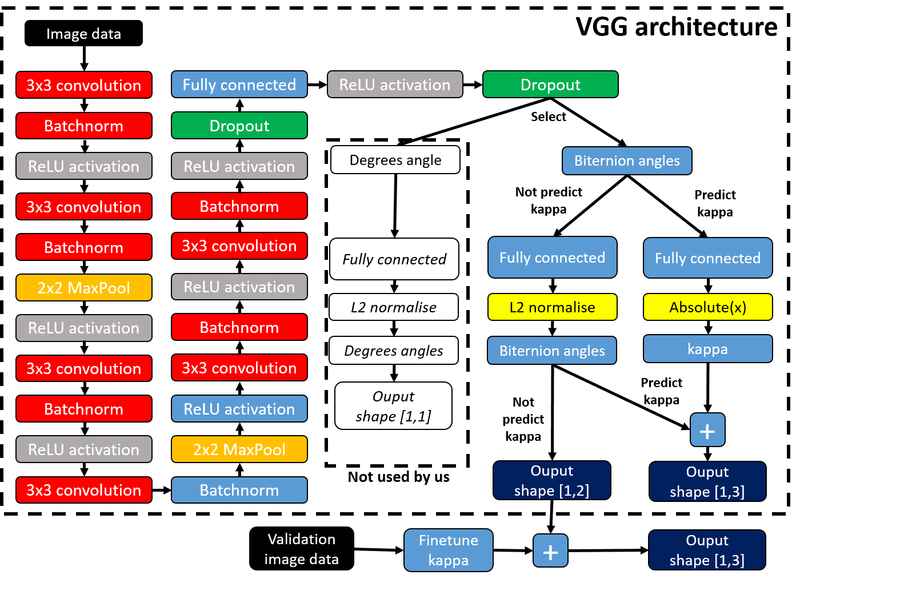
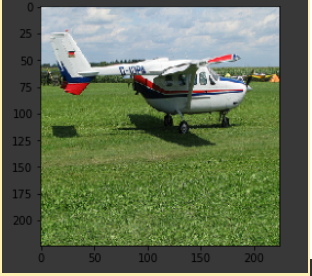
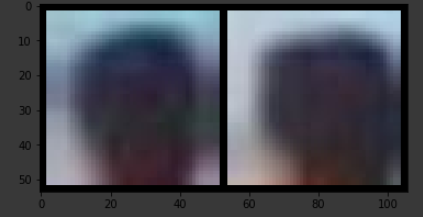
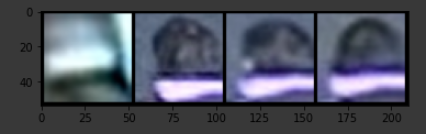
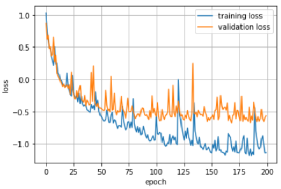
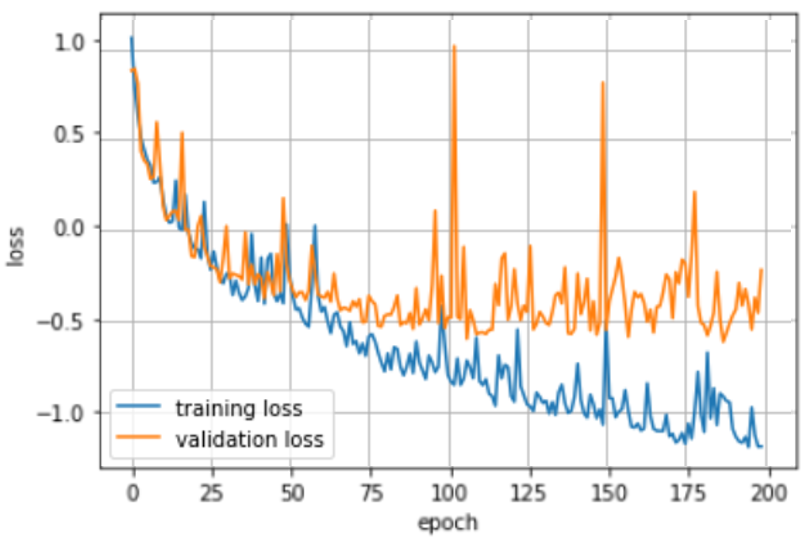
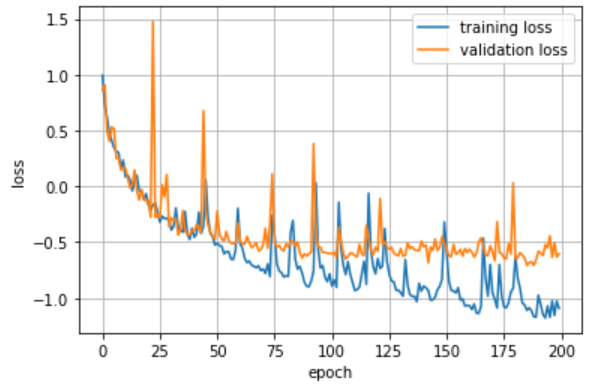

# Pose Estimation using VGG-style network and InceptionResNet
The link for the paper which is reproduced is [here](https://eccv2018.org/openaccess/content_ECCV_2018/papers/Sergey_Prokudin_Deep_Directional_Statistics_ECCV_2018_paper.pdf).
## Introduction
This blog aims to describe our efforts into reproducing the paper “Deep Directional Statistics: Pose Estimation with Uncertainty Quantification”. The paper discusses a method to perform tasks object pose estimation using uncertainty quantification. This uncertainty quantification allows for an increased robustness against images of varying quality.

The proposed method for uncertainty quantification consists of using a VGG-style convolutional network combined with a probabilistic von Mises distribution to predict the distribution over the object pose angle. The paper discusses three different types of von Mises distributions. First, where a single value determines the shape of the distribution. Second, where a finite number of mixture components determines the shape and third, where an infinite number of mixture components defines the shape. For this blog only the first variant will be elaborated. The data used for pose estimation are the PASCAL3D+, TownCentre and CAVIAR-o datasets. The CAVIAR-o and TownCentre datasets present a challenging task of coarse gaze estimation as the images are of low resolution, as they are obtained from surveillance camera videos. In the CAVIAR dataset, the images with occluded head instances are only considered for the dataset. Hence this paper aims to produce a Deep neural network focussed on head pose detection in crowded places from the surveillance cameras. 

### Biternion representation
As head pose is about angular orientation it is generally hard to find a sufficient loss function for training. This is because angular orientation has a periodic nature and is therefore discontinuous. Predicted values close to the ground truth can be reset to the next period and be penalized very badly in conventional loss function. This paper solves that problem by using Biternion networks, which is a different parameterization of angles removing this periodic aspect. 

### Concentration parameter kappa
The concentration parameter kappa is a measure of concertration of the data around the mean, or predicted, value of the distribution. The influence of kappa on a distribution is illustrated below (image taken from original report). As can be observed, higher kappa value concentrates the data towards the centre of the distribution making a prediction more certain.


### Original code
The paper is provided with code, which is written in Tensorflow using the Keras high-level API. These software packages go about in a different way of building neural networks compared to Pytorch. The paper itself describes little about steps followed to achieve the desired results, and given that it is quite a complicated topic made rebuilding the code, from TensorFlow, in Pytorch a difficult process. However, it did provide a good basis to learn on.

## Understanding the original code in Keras
<!-- As we both are novices in both Pytorch and Tensorflow understanding the original code was already quite a big task. Additionally, --> Most of the code was uncommented and we were not able to run the code out of the box for any of the datasets/loss-function scenarios. In order to fully understand the deep neural net proposed in the paper the main focus was to get the single density model running for the PASCAL3D+ dataset. This was considered an essential addition to the explanation provided in the paper for us to understand what is exactly happening.

### Information propagation
We started out by learning how a neural network is built and trained within Tensorflow. This meant getting to grips with the functional Keras API and Tensorflow syntax that is used. A good place to start was to pinpoint the propagation of information through the model. This propagation is dependent on which model type is run, of which there are two. 

1. Use the network to predict the biternion angles, as well as the kappa value. 
1. Use the network to solely predict the biternion angles, followed by calculating kappa by maximizing the von Mises log likelihood. 

A visualisation of the information flow as extracted from the Keras code is illustrated below.

<p align="center">
  
  </p>

## Implementation in Pytorch
With a good understanding of the Tensorflow code the logic can be applied to our Pytorch implementation. This implementation will be elaborated below in stepwise fashion. 

### Setting up the Google Colab environment
The first step in the code building process is to setup the Google Colab environment. We do this by connecting Google Colab to Google Drive and setting the working directory to the right folde. All relevant documentation is uploaded to the `deep_direct_stat-master` folder which can be accessed directly from the Colab document. 

```markdown
import os
from google.colab import drive
drive.mount("/content/drive")
os.chdir('/content/drive/My Drive/Deep Learning/deep_direct_stat-master')
```

### Network Architecture
As illustrated in the section above, the architecture used in the paper is a VGG-style network with five 3x3 convolutional layers. Six batch normalization layers are used and volume reduction is performed using two 2x2 max pooling layers. Rectified Linear Units are used as activation functions throughout the network and dropout is used twice for generalization purposes. The output of the model is made absolute when predicting kappa, or normalized using L2 normalization when predicting the gaze angle. The amount of trainable parameters for the PASCAL3D+ image input size (3x224x224) is 78,781,822. For the CAVIAR-o and TownCentre image input size (3x50x50) the amount of trainable paramters is 923,515. Our implementation of the architecture in Pytorch is illustrated below. Note that the number of inputs for the fully connected layer in the sequential part of the model depends on the input dataset. For the PASCAL3D+ this number is equal to 153,664, whereas for the TownCentre and CAVIAR-o set this number equals 1600.

```markdown
class vgg_model(nn.Module):
  def __init__(self, n_outputs=1, conv_dropout_val=0.2, 
               fc_dropout_val=0.5, fc_layer_size=512):
      super(vgg_model, self).__init__()
      self.VGG_backbone = nn.Sequential(
          nn.Conv2d(3, 24, kernel_size=3, stride=1), 
          nn.BatchNorm2d(24),         
          nn.ReLU(),               
          nn.Conv2d(24, 24, kernel_size=3, stride=1), 
          nn.BatchNorm2d(24), 
          nn.MaxPool2d(2),            
          nn.ReLU(),
          nn.Conv2d(24, 48, kernel_size=3, stride=1),
          nn.BatchNorm2d(48),
          nn.ReLU(),
          nn.Conv2d(48, 48, kernel_size=3, stride=1),
          nn.BatchNorm2d(48),
          nn.MaxPool2d(2),
          nn.ReLU(),
          nn.Conv2d(48, 64, kernel_size=3, stride=1),
          nn.BatchNorm2d(64),
          nn.ReLU(),
          nn.Conv2d(64, 64, kernel_size=3, stride=1),
          nn.BatchNorm2d(64),
          nn.ReLU(),
          nn.Dropout2d(conv_dropout_val), 
          nn.Flatten(),
          nn.Linear(5*5*64, 512),      
          nn.ReLU(),                                                          
          nn.Dropout2d(fc_dropout_val))                                       
      self.final_layer = nn.Linear(512, n_outputs)
      self.kappa_predict = nn.Linear(512, 1)
      self.ypred = nn.Linear(512, 2)

  def forward(self, input, predict_kappa=True, final_layer=False, l2_normalize_final=False): 
      x_vgg = self.VGG_backbone(input)
      if final_layer:
          x = self.final_layer(x_vgg)
      if l2_normalize_final:
          x = F.normalize(x,dim=1,p=2)
      if not final_layer:
          if predict_kappa:
              x_ypred = F.normalize(self.ypred(x_vgg), dim=1,p=2)
              x_kappa = torch.abs(self.kappa_predict(x_vgg))
              x = torch.cat((x_ypred, x_kappa), 1)
          if not predict_kappa:
              x = F.normalize(self.ypred(x_vgg), dim=1, p=2)
      return x
```

### Datasets
The datasets under consideration are PASCAL 3D+, CAVIAR-o and Towncentre datasets and they are divided into three parts namely training , validation and testing. the distribution are as shown as follows.

<center>

  |Dataset | PASCAL 3D+ | CAVIAR-o | Towncentre|
  |------------ |:-------------:|:-----------:|:---------:|
  |Train set | 2247 | 10802 | 6916|
  |Validation set| 562 | 5444 | 874|
  |Test set  | 275 |5445 | 904|

</center>

#### Visualisation of the dataset
In order to get a better understanding of the datasets, individual images for any of the three datasets can be plotted using the script below. This can improve our intuition in working with the data, e.g. why the towncentre dataset is a more tough dataset to deal with compared to the CAVIAR-o due to the increased blurryness.

```markdown
import matplotlib.pyplot as plt

sample = next(iter(train_loader))
image, label = sample

grid = torchvision.utils.make_grid(image[1], nrow=1 )
plt.figure(figsize=(15,15))
plt.imshow(np.transpose(grid, (1,2,0)))
```

PASCAL 3D+ contains the 10 different classes of images with the size of 224x224x3. The truth values contain the three canonical angles. The airplane class data has been used to train, validate and test the model. Since for a deep learning network needs a large amount of dataset to learn the features, a large amount of images from the dataset have been used in the training. The validation set has been used in the model to influence the 'kappa' value. kappa value is a measure of concertration of the data around the mean value of the distribution. This plays a major role in increasing the probability of finding the accurate value of the object pose. The PASCAL 3D+ data can be downloaded [here](https://drive.google.com/file/d/1baI_QUNuGN9DJGgaOWubbservgQ6Oc4x/view). The dataset is visualized as below.


<p 
align="center">
  
</p>

CAVIAR-o dataset contains images of partially occluded heads , the images have been upscaled to 50x50x3 images from their original size of 7x7x3 images. the truth values contain the gaze angle in degrees. Due to availability of the more images , the number of validation set and testing set are increased. This dataset pose a challenge for the network due to two things mainly, upscale and blur in the image. The CAVIAR-o data can downloaded from [here](https://omnomnom.vision.rwth-aachen.de/data/BiternionNets/). The caviar data is visualized as below.

<p 
align="center">
  
</p>

Towncentre dataset contains images from the videoclip recorded from a surveillance camera. The images are of size 50x50x3. The truth values contain the gaze angle in degrees.  This dataset contains heads of tracked pedestrians in a shopping district, annotated with head pose regression labels. The towncentre data can be downloaded [here](https://omnomnom.vision.rwth-aachen.de/data/BiternionNets/). The towncentre data is visualized as below.

<p 
align="center">
  
</p>

The towncentre dataset and caviar datasets required some preprocessing as the downloaded file format (i.e .bz2 format) and input format (.pkl.gz format) needed to run the model are different, for this we referred to the [Lucas Beyers](https://github.com/lucasb-eyer/BiternionNet/tree/e0cf7d29bfa177e4d8eded463e2c8304b78e2984) repository in order to find the source and methods required to download and preprocess the data. After preprocessing the data is then converted to pytorch tensors using `torch.tensor(..)` and `.permute(..)` methods so as to input them into the dataloader readable format. The data downloaded for each dataset respectively should be placed in the root folder before running the dataloading process.
### DataLoader
All datasets used in the paper are not standard sets that are included within the Pytorch computer vision package, torchvision. Therefore, we have to write our own DataSet class that will be used later on to run the batches in the training process. With this DataSet class we can access all the training samples in the dataset. The first step is to load the datasets, which is done with a script provided by the author that splits the dataset in a training, validation and test set. Second, we inherit the functionality of the DataSet class in our dataloader, which is done by overwriting the `__len__` and `__getitem__` methods. The defined DataSet class now serves as input for the DataLoader class, which additionally accepts the parameter batch_size. The DataLoader is used to run through the data in the training process of our model.The data format from the images obtained was uint8 but the model could not be trained using this datatype as weights of the network cannot be initialized with uint8, hence the datatype of the data was changed to float32.

```markdown
from torch.utils.data import Dataset
from torch.utils.data import DataLoader
from datasets import pascal3d
from datasets import caviar
from datasets import towncentre

### Loading and preparing the PASCAL3D+ dataset
cls = 'aeroplane' # if cls is None, all classes will be loaded
pascaldb_path = 'data/pascal3d+_imagenet_train_test.h5'
x_train_tf, y_train_tf, x_val_tf, y_val_tf, x_test_tf, y_test_tf = pascal3d.load_pascal_data(pascaldb_path, cls=cls)

x_train = (torch.tensor(x_train_tf[:])).permute(0, 3, 1, 2).float()
y_train = torch.tensor(y_train_tf[:])
x_val = (torch.tensor(x_val_tf[:])).permute(0, 3, 1, 2).float() 
y_val = torch.tensor(y_val_tf[:])
x_test = (torch.tensor(x_test_tf[:])).permute(0, 3, 1, 2).float() 
y_test = torch.tensor(y_test_tf[:])

# Loading and preparing the CAVIAR-o dataset
caviar_path = 'data/CAVIAR-o.pkl.gz'
(xtr_cav, ytr_cav_deg, info_tr), (xval_cav, yval_cav_deg, info_val), (xte_cav, yte_cav_deg, info_te) = caviar.load_caviar(caviar_path)

ytr_cav_bit = deg2bit(ytr_cav_deg)
yval_cav_bit = deg2bit(yval_cav_deg)
yte_cav_bit = deg2bit(yte_cav_deg)
xtr_cav = (torch.tensor(xtr_cav[:])).permute(0, 3, 1, 2).float() 
ytr_cav_bit = torch.tensor(ytr_cav_bit[:])
xval_cav = (torch.tensor(xval_cav[:])).permute(0, 3, 1, 2).float() 
yval_cav_bit = torch.tensor(yval_cav_bit[:])
xte_cav = (torch.tensor(xte_cav[:])).permute(0, 3, 1, 2).float() 
yte_cav_bit = torch.tensor(yte_cav_bit[:])

# Loading and preparing the TownCentre dataset
towncentre_path = 'data/TownCentre.pkl.gz'
(xtr_tc, ytr_tc_deg, img_names_tr), (xval_tc, yval_tc_deg, img_names_val), (xte_tc, yte_tc_deg, img_names_te) = towncentre.load_towncentre(towncentre_path)

ytr_tc_bit = deg2bit(ytr_tc_deg)
yval_tc_bit = deg2bit(yval_tc_deg)
yte_tc_bit = deg2bit(yte_tc_deg)
xtr_tc = (torch.tensor(xtr_tc[:])).permute(0, 3, 1, 2).float() 
ytr_tc_bit = torch.tensor(ytr_tc_bit[:])
xval_tc = (torch.tensor(xval_tc[:])).permute(0, 3, 1, 2).float() 
yval_tc_bit = torch.tensor(yval_tc_bit[:])
xte_tc = (torch.tensor(xte_tc[:])).permute(0, 3, 1, 2).float() 
yte_tc_bit = torch.tensor(yte_tc_bit[:])

class dataloader(Dataset):
  def __init__(self, samples, labels):
    self.labels = labels
    self.samples = samples

  def __len__(self):
    return len(self.samples)
  
  def __getitem__(self, index):
    sample = self.samples[index]
    label = self.labels[index]
    return sample, label

# select dataset
load_dataset = 'towncentre'

device = "cuda" if torch.cuda.is_available() else "cpu"
kwargs = {'num_workers': 1, 'pin_memory': True} if device=='cuda' else {}

if load_dataset == 'pascal':
    train_set = dataloader(x_train, y_train[:, 0:2])
    val_set = dataloader(x_val, y_val[:, 0:2])
    test_set = dataloader(x_test, y_test[:, 0:2])

    train_loader = DataLoader(train_set, batch_size=15, shuffle=False, `**kwargs`)
    val_loader = DataLoader(val_set, batch_size=15, `**kwargs`) 
    test_loader = DataLoader(test_set, batch_size=15, `**kwargs`)

elif load_dataset == 'caviar':
      train_set = dataloader(xtr_cav, ytr_cav_bit[:, 0:2])
      val_set = dataloader(xval_cav, yval_cav_bit[:, 0:2])
      test_set = dataloader(xte_cav, yte_cav_bit[:, 0:2])

      train_loader = DataLoader(train_set, batch_size=5, shuffle=False, `**kwargs`)
      val_loader = DataLoader(val_set, batch_size=15, `**kwargs`) 
      test_loader = DataLoader(test_set, batch_size=15, `**kwargs`)

elif load_dataset == 'towncentre':
      train_set = dataloader(xtr_tc, ytr_tc_bit[:, 0:2])
      val_set = dataloader(xval_tc, yval_tc_bit[:, 0:2])
      test_set = dataloader(xte_tc, yte_tc_bit[:, 0:2])

      train_loader = DataLoader(train_set, batch_size=5, shuffle=True, `**kwargs`)
      val_loader = DataLoader(val_set, batch_size=15, `**kwargs`) 
      test_loader = DataLoader(test_set, batch_size=15, `**kwargs`)     

data_loaders = {'train': train_loader, 'val': val_loader, 'test': test_loader} 
```

```

### Recoding supportive functions from Tensorflow to Pytorch
The single density model requires several functions that are not built into Pytorch, but were provided in the Tensorflow code by the original author of the paper. These original functions were not usable within our Pytorch environment, as they were written in either tensorflow, Keras and/or numpy. The functions included loss functions and angle conversions. Our implementation of these functions in Pytorch is provided below.

``` markdown
# Loss functions
def cosine_loss_py(y_target, y_pred):
    loss = 1 - torch.sum(torch.mul(y_target, y_pred), dim=1)
    mean_loss = torch.mean(loss)
    return mean_loss

def von_mises_neg_log_likelihood_py(y_true, y_pred):
    mu_pred = y_pred[:, 0:2]
    kappa_pred = y_pred[:, 2:]
    return -torch.mean(von_mises_log_likelihood_py(y_true, mu_pred, kappa_pred, input_type='biternion'))

# Conversion of von_mises_log_likelihood_tf
def von_mises_log_likelihood_py(y_true, mu_pred, kappa_pred, input_type='biternion'):
    if input_type == 'degree':
        scaler = 0.0174533
        cosin_dist = torch.cos(scaler * (y_true - mu_pred))
    elif input_type == 'radian':
        cosin_dist = torch.cos(y_true - mu_pred)
    elif input_type == 'biternion':
        cosin_dist = torch.reshape(torch.sum(torch.mul(y_true, mu_pred), axis=1), [-1, 1])
    log_likelihood = kappa_pred * cosin_dist - \
                     torch.log(2 * torch.tensor([math.pi]).to(device)) - log_bessel_approx_py(kappa_pred) #torch.log(2 * torch.tensor([math.pi])) - log_bessel_approx_py(kappa_pred) 
    return torch.reshape(log_likelihood, [-1, 1])

# Conversion of log_bess_approx_tf
def log_bessel_approx_py(x):
    x = torch.reshape(x, [-1, 1])

    def log_bessel_approx_0(x):
        bessel_taylor_coefs = torch.tensor([1.00000000e+00, 2.50000000e-01, 1.56250000e-02,
                                          4.34027778e-04, 6.78168403e-06]).to(device)
        m = bessel_taylor_coefs.shape[0]
        deg = torch.reshape(torch.arange(0, m, 1) *2 , [1, -1])
        n_rows = x.size(0)
        x_tiled = x.repeat(1,m)
        deg_tiled = deg.repeat(n_rows,1)
        deg_reshape = torch.reshape(bessel_taylor_coefs[0:m],[1,m])
        coef_tiled = deg_reshape.repeat(n_rows,1)
        deg_tiled = deg_tiled.type(torch.FloatTensor).to(device)
        val = torch.log(torch.sum(torch.pow(x_tiled, deg_tiled)*coef_tiled, axis=1))
        return torch.reshape(val, [-1, 1])

    def _log_bessel_approx_large(x):
        return x - 0.5*torch.log(2*torch.tensor([math.pi]).to(device)*x)         
    res = torch.where(x > 5.0, _log_bessel_approx_large(x), _log_bessel_approx_0(x))
    return res

# Angle conversions
def rad2bit_py(angles_rad):
    return torch.tensor([torch.cos(angles_rad), torch.sin(angles_rad)]).to(device).T 

def deg2bit_py(angles_deg):
    angles_rad = angles_deg * torch.tensor([math.pi]).to(device) / 180              
    return torch.tensor([torch.cos(angles_rad),torch.sin(angles_rad)]).to(device).T #torch.tensor([torch.cos(angles_rad),torch.sin(angles_rad)]).T 

def rad2deg(angle_rad):
    return angle_rad * 180 / torch.tensor([math.pi]).to(device)

def bit2deg_py(angles_bit):
    return (rad2deg(torch.atan2(angles_bit[:,1], angles_bit[:,0])) + 360) %360

def deg2rad(angle_deg):
    return angle_deg * torch.tensor([math.pi]).to(device) / 180 #angle_deg * torch.tensor([math.pi]) / 180 

def maad_from_deg_py(y_pred, y_target):
    return  rad2deg(torch.abs(torch.atan2(torch.sin(deg2rad(y_target - y_pred)).to(device),
                                          torch.cos(deg2rad(y_target - y_pred)).to(device)).to(device)).to(device)) 

```
### Loss Function
The loss function used here is `von_mises_log_likelihood` which calculates the loss function as shown in the equation below


### Training and validation
The training and validation algorithm used in the Pytorch implemenation is illustrated below. This is different to the Keras implementation, where a single line of code suffices to start training a model. As previously explained, we iterate over the created dataloader to provide the training algorithm with the batches of images. All computations happen via the GPU. After each training epoch the model is validated using the validation test set. Additionally, the averaged training loss and validation loss per batch are printed and stored after every epoch. Finally, the loss curves are plotted against the number of epochs to evaluate the model for fitting behaviour.

```markdown
import time
import copy

def train(data_loaders, model, n_epochs, optimizer, criterion):
    since = time.time()                       
    best_model_weights = copy.deepcopy(model.state_dict())
    best_loss = 99999
    loss_train = []
    loss_val = []
    
    for epoch in range(n_epochs):
        print('Epoch {}/{}'.format(epoch, n_epochs - 1))
        print('-' * 10)
     
        # switch between training & validation phase of epoch
        for phase in ['train', 'val']: 
            if phase == 'train':
                model.train()    
            else:
                model.eval()      
                
            running_loss = 0.0    
            for i, data in enumerate(data_loaders[phase]): 
                x_input, y_true = data  
                x_input, y_true = x_input.to(device), y_true.to(device) 
                optimizer.zero_grad() # zero the parameter gradients
                    
                    # forward + loss
                with torch.set_grad_enabled(phase == 'train'): 
                    y_pred = model(x_input) # run the model
                    loss = criterion(y_true, y_pred) # calculate the loss
                 
                    # backprop + optimization during the training phase
                    if phase == 'train': 
                        loss.backward(torch.ones_like(loss))
                        optimizer.step()
                running_loss += loss.item() * len(x_input) 
               
                # loss statistics
            if phase == 'train':
                epoch_loss = running_loss / len(data_loaders['train'].dataset)
                loss_train.append(epoch_loss)
                
            elif phase == 'val':
                epoch_loss = running_loss / len(data_loaders['val'].dataset)
                loss_val.append(epoch_loss)
                
            print('{} Loss: {:.4f}'.format(
                phase, epoch_loss))
                
            if phase == 'val' and epoch_loss < best_loss: # deep copy the model scoring best on validation loss
                best_loss = epoch_loss
                best_model_weights = copy.deepcopy(model.state_dict())

                torch.save({'epoch': epoch,
                'model_state_dict': model.state_dict(),
                'optimizer_state_dict': optimizer.state_dict(),
                'loss': loss}, 'training_data/model_weights_caviar.tar')
                
    time_elapsed = time.time() - since
    print('Training complete in {:.0f}m {:.0f}s'.format(
        time_elapsed // 60, time_elapsed % 60))
    print('Best val loss: {:4f}'.format(best_loss))

    # load best model weights
    model.load_state_dict(best_model_weights)

    # plot and save losses
    plt.plot(loss_train)
    plt.plot(loss_val)
    plt.xlabel('epoch')
    plt.ylabel('loss')
    plt.legend(['training loss', 'validation loss'])
    plt.grid(True)
    plt.show()
    np.savetxt('training_data/loss_train_TC_lr0-001_batch-100_epoch-50.csv', loss_train)
    np.savetxt('training_data/loss_val_TC_lr0-001_batch-100_epoch-50.csv', loss_val)
    return model
```
### Finetuning kappa
When the model is not set to make a prediction for kappa, i.e. `predict_kappa=False`, the value for kappa will be calculated after training and validating by running `finetune_kappa` script below. It calculates the kappa by maximizing the log-likelihood. The script was provided in the original Tensorflow code and was rewritten in order to be used within the Pytorch environment.

``` markdown
def finetune_kappa(x,y_bit,max_kappa = 1000.0, verbose =False):
    ytr_preds_bit = model(x)[:,0:2]
    kappa_vals = torch.arange(0,max_kappa,1.0).to(device)
    log_likelihoods = torch.zeros(kappa_vals.shape).to(device)
    for i,kappa_val in enumerate(kappa_vals):
        kappa_preds = torch.ones([x.shape[0], 1]).to(device) * kappa_val       
        log_likelihoods[i] = torch.mean(von_mises_log_likelihood_np_py(y_bit, ytr_preds_bit,kappa_preds))
        if verbose:
            print("kappa: %f, log-likelihood: %f" % (kappa_val,log_likelihoods[i]))
    max_ix = torch.argmax(log_likelihoods)
    fixed_kappa_value = kappa_vals[max_ix]
    if verbose:
        print("best kappa : %f" % fixed_kappa_value)
    return fixed_kappa_value
```

### Evaluation 
In addition to the training and validation script, the majority of the evaluation script is recoded to work inside the Pytorch environment. The implementation is provided below. 

```markdown
def evaluation(data_loaders, model, return_per_image=False, predict_kappa=True):

     # initialize empty tensors for concatenation
    kappa_preds = torch.Tensor().to(device)  
    loss = torch.Tensor().to(device)         
    ypreds = torch.Tensor().to(device) 
    
    with torch.no_grad():
    
        # extract data and predict using the testset
        for data in data_loaders['test']:
            x, ytrue_bit_batch = data
            x, ytrue_bit_batch = x.to(device), ytrue_bit_batch.to(device)
            ypreds_batch = model(x)
            ypreds = torch.cat((ypreds, ypreds_batch), 0)
            
        # convert predicted labels and ground truth labels
        ytrue_bit = (data_loaders['test'].dataset.labels).to(device)
        ytrue_deg = bit2deg_py(ytrue_bit)
        ypreds_deg = bit2deg_py(ypreds)   

        # determine kappa value
        if predict_kappa:
            kappa_preds = ypreds[:, 2:]       
        elif not predict_kappa:
            kappa_preds = torch.ones([ytrue_deg.shape[0], 1]) * self.fixed_kappa_value
            
        # calculate MAAD loss
        loss = (maad_from_deg_py(ypreds_deg, ytrue_deg).float()).cpu()
        
    # bookkeeping
    results = dict()
    results['maad_loss'] = float(torch.mean(loss))
    results['maad_loss_sem'] = float(sem(loss))
    print("MAAD error : %f pm %fSEM" % (results['maad_loss'],
                                            results['maad_loss_sem']))  
    results['mean_kappa'] = float(torch.mean(kappa_preds))
    results['std_kappa'] = float(torch.std(kappa_preds,unbiased=False))
    
    log_likelihoods = (von_mises_log_likelihood_py(ytrue_bit[:,0:2], ypreds[:,0:2], kappa_preds)).cpu()

    results['log_likelihood_mean'] = float(torch.mean(log_likelihoods))
    results['log_likelihood_sem'] = float(sem(log_likelihoods, axis=None)) 
    print("log-likelihood : %f pm %fSEM" % (results['log_likelihood_mean'], 
                                                results['log_likelihood_sem']))
    if return_per_image:                      
        results['point_preds'] = bit2deg_py(deg2bit_py(ypreds_deg))
        results['maad'] = loss
        results['log_likelihood'] = log_likelihoods
    
    return results
```

## Results
The results of pytorch model and authors keras model with single density function model are discussed here. All the three datasets mentioned earlier are compared and the Table 2 of the [Sergey Prokudin et al](https://eccv2018.org/openaccess/content_ECCV_2018/papers/Sergey_Prokudin_Deep_Directional_Statistics_ECCV_2018_paper.pdf) paper are discussed. 
Apart from reproducing the results from the table, two different aspects of losses and errors are compaired here:
1. Effects of losses with variation in batch sizes during training.
2. Comparison of Losses and error authors keras models and our pytorch model.

## 1.Effects of losses with variation in batch sizes during training
The loss of distribution in training data and validating data give information about overfitting and underfitting of the model. The paper under consideration of reproduction does not state any facts or arguments about a few important parameters like: data batch sizes for training and validation or division. Hence we deemed it important to evaluate these parameters in order to produce good results for the data. 

<p 
align="center">

</p>
<p 
align="center">
Figure: loss variation with different batch sizes
</p>
From the above image we can see that having a lower batch size the loss fluctuations over each epoch is high and as and when the batch size is increased the loss fluctuation is decreased. This is based on the research conducted by [Sam McCandlish et al](https://arxiv.org/pdf/1812.06162.pdf) We can observe that in the caviar dataset trained over batch size of 100 and 50 batches respectively

<p 
float="left">

 

  </p>

## 2. Comparison of Losses and error authors keras models and our pytorch model
To compare the error values in the Table 2. we have to achieve a comparable model in pytorch as the model in keras. Hence we carried out various training and validations to compare the models. The plots of test and validation losses for similar setup in both keras model and pytorch model are shown below.

## insert the keras and pytorch model results for different datasets

Here we can see that the models are able to fit the data with comparable losses and hence can be used to compare the MAAD and Log likelihood errors. The MAAD error refers to the mean absolute angular deviation which is a widely used metric for angular regression tasks. The log likelihood error is a widely accepted scoring rule for assessing the quality of probabilistic predictions. 

## Reproduction of Table 2 from authors paper
After running models in different scenarios we finalized on the batch size of ... , epoch size of ... and learning rate of ... in order to achieve the results from the table 2. We have achieved comparable results with our pytorch model as shown below in the table.
We can observe that the errors for CAVIAR-o dataset is less than 6 percent and errors for towncentre dataset from our model is less than 7 percent of the value of errors in authors model.

| Dataset: | CAVIAR-0| CAVIAR-o | Towncentre | Towncentre |
------------ | -------------|-----------|---------| -------|
Crieria: | MAAD | log-likelihood | MAAD | log-likelihood |
------------ | -------------|-----------|---------| -------|
| Beyer et al., fixed k| 5.74deg +/- 0.13 | 0.262 +/- 0.031| 22.8deg +/- 1.0 |-0.89 +/- 0.06|
| Ours, fixed k | | | | | 
|Prokudin, Single von Mises | 5.53deg +/- 0.13 | 0.700 +/- 0.043 | 22.9deg +/- 1.1 | -0.57 +/- 0.05 | 
|Pytorch Reproduction, Single von Mises | **5.21deg +/- 0.15 | 0.717 +/- 0.070|  24.4deg +/- 1.08 | -0.78 +/- 0.06**|

Hence the results in the paper are reproduced.

