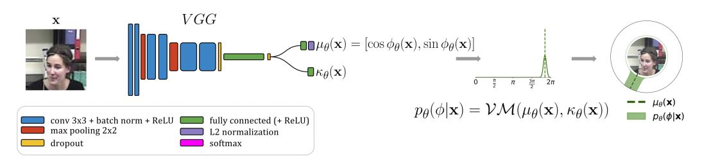
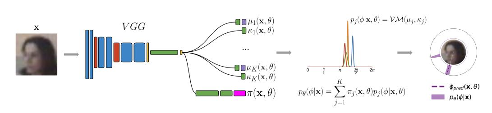

## Pose Estimation using VGG-style network and InceptionResNet
The link for the paper which is reproduced is [here](https://eccv2018.org/openaccess/content_ECCV_2018/papers/Sergey_Prokudin_Deep_Directional_Statistics_ECCV_2018_paper.pdf).
## Introduction
This blog aims to describe our efforts into reproducing the paper “Deep Directional Statistics: Pose Estimation with Uncertainty Quantification”. The paper discusses a method to perform tasks object pose estimation using uncertainty quantification. This uncertainty quantification allows for an increased robustness against images of varying quality.

The proposed method for uncertainty quantification consists of using a VGG-style convolutional network combined with a probabilistic von Mises distribution to predict the distribution over the object pose angle. The paper discusses three different types of von Mises distributions. First, where strong assumptions are made about the distribution. Second, where a finite number of mixture components determines the shape and third, where an infinite number of mixture components defines the shape. For this blog only the first two will be elaborated. The Pascal 3D+ dataset is used as testbed to study the general object pose estimation. The CAVIAR-o and TownCentre datasets presents a challenging task of corase gaze estimation as the images are of low resolution which are obtained from surveillance camera videos. In the CAVIAR dataset, the occulded the head instances are considered for testing. Hence this paper aims to produce a Deep neural network focussed on head pose detection in crowded places from the surveillance cameras. 

The paper was provided with code, which was written in Tensorflow using the Keras high-level API. These software packages go about in a different way of building neural networks compared to Pytorch. The paper itself describes little about steps followed to achieve the desired results, and given that it is quite a complicated topic made rebuilding the code, from TensorFlow, in Pytorch a difficult process. However, it did provide a good basis to learn on.

# Setting up the Google Colab environment
The first step in the code building process is to setup the Google Colab environment. We do this by connecting Google Colab to Google Drive and setting the working directory to the right folde. All relevant documentation is uploaded to the `deep_direct_stat-master` folder which can be accessed directly from the Colab document. 

```markdown
import os
from google.colab import drive
drive.mount("/content/drive")
os.chdir('/content/drive/My Drive/Deep Learning/deep_direct_stat-master')
```

## Network Architecture
The architecture of the network is similar between the single density and finite mixture models. The network can be considered very deep and sequential with 24 layers. There are 5 convolution layers used which have 3x3 kernel sizes throughout. The volume reduction is taken care by the max pooling layer of size 2x2 which is used twice in the network. The Batch normalizations are used to normalize the values of the running averages which are 6 in number . ReLU (Rectified Linear Unit  is used as the activation functions . The Layers are flattened in the end using Linear layer and then Dropout is carried out in order to obtain more accurate weights of the network. The Network when used for training a 224x224x3 image, it has 78,781,822 trainable parameters. The total parameter size is about 300 MB. The network can be visualized as shown below.

The single mixture model can be visualized as below. There is only one simple von mises distribution used to obtain the pose of the object. Hence only one distribution can be seen as the output in the network.


The finite mixture model can be visualized as below. A complex distribution is generated by summing up multiple distribution in the case of finite mixture model. Here each component is a simple von mises distribution. Hence a finite number of distribution can be seen in the output of the network.



The input for the network is a RGB image and the output is 1x6 tensor having predicted angles of the pose of the object in the image, which are in the bit format. This is not a conventional output format and has effects on usage of the standard loss functions such as cross entropy loss function.

[comment](```markdown
class vgg_model(nn.Module):
  def __init__(self, n_outputs=6, image_height=224, image_width=224, n_channels=3, 
               conv_dropout_val=0.2, fc_dropout_val=0.5, fc_layer_size=512):
    super(vgg_model, self).__init__()
    self.conv_layer1 = nn.Sequential(
        nn.Conv2d(3, 24, kernel_size=3, stride=1), 
        nn.BatchNorm2d(24),         
        nn.ReLU())                  
    self.conv_layer2 = nn.Sequential(
        nn.Conv2d(24, 24, kernel_size=3, stride=1), 
        nn.BatchNorm2d(24), 
        nn.MaxPool2d(2),            
        nn.ReLU())
    self.conv_layer3 = nn.Sequential(
        nn.Conv2d(24, 48, kernel_size=3, stride=1),
        nn.BatchNorm2d(48),
        nn.ReLU())
    self.conv_layer4 = nn.Sequential(      
        nn.Conv2d(48, 48, kernel_size=3, stride=1),
        nn.BatchNorm2d(48),
        nn.MaxPool2d(2),
        nn.ReLU())
    self.conv_layer5 = nn.Sequential(
        nn.Conv2d(48, 64, kernel_size=3, stride=1),
        nn.BatchNorm2d(64),
        nn.ReLU())
    self.conv_layer6 = nn.Sequential(
        nn.Conv2d(64, 64, kernel_size=3, stride=1),
        nn.BatchNorm2d(64),
        nn.ReLU())
    self.dropout7 = nn.Sequential(
        nn.Dropout2d(conv_dropout_val))
    self.dense_layer8 = nn.Sequential(
        nn.Flatten(),
        nn.Linear(49*49*64, 512),       
        nn.ReLU())                                                                        
    self.dropout9 = nn.Dropout2d(fc_dropout_val)                                            
    self.dense_layer10 = nn.Linear(512, n_outputs)

  def forward(self, input, final_layer=False, l2_normalize_final=False): 
    x = self.conv_layer1(input)
    x = self.conv_layer2(x)
    x = self.conv_layer3(x)
    x = self.conv_layer4(x)
    x = self.conv_layer5(x)
    x = self.conv_layer6(x)
    x = self.dropout7(x)
    x = self.dense_layer8(x)
    x = self.dropout9(x)
    if final_layer:
      x = self.dense_layer10(x)
      if l2_normalize_final:
        x = F.normalize(x,dim=1,p=2)    
    return x  
```)
The summary of the model is as shown below with the details of number of trainable parameters and sizes of each layer.


## Dataset and DataLoader
All datasets used in the paper are not standard sets that are included within the Pytorch computer vision package, torchvision. Therefore, we have to write our own DataSet class that will be used later on to run the batches in the training process. With this DataSet class we can access all the training samples in the dataset. The first step is to load the PASCAL3D+ dataset using a script provided by the author to split the dataset in a training, validation and test set. Second, we inherit the functionality of the DataSet class in our dataloader, which is done by overwriting the `__len__` and `__getitem__` methods. The defined DataSet class now serves as input for the DataLoader class, which additionally accepts the parameter batch_size. The DataLoader is used to run through the data in the training process of our model.

```markdown
from torch.utils.data import Dataset
from torch.utils.data import DataLoader
from datasets import pascal3d

'<cls = 'aeroplane' # if cls is None, all classes will be loaded>'
pascaldb_path = 'data/pascal3d+_imagenet_train_test.h5'
x_train_tf, y_train_tf, x_val_tf, y_val_tf, x_test_tf, y_test_tf = pascal3d.load_pascal_data(pascaldb_path, cls=cls)

# preparing the pascal3d dataset for the pytorch environment
x_train = (torch.tensor(x_train_tf[:])).permute(0, 3, 1, 2).float() 
y_train = torch.tensor(y_train_tf[:])
x_val = (torch.tensor(x_val_tf[:])).permute(0, 3, 1, 2).float() 
y_val = torch.tensor(y_val_tf[:])
x_test = (torch.tensor(x_test_tf[:])).permute(0, 3, 1, 2).float() 
y_test = torch.tensor(y_test_tf[:])

class dataloader(Dataset):
  def __init__(self, samples, labels):
    self.labels = labels
    self.samples = samples

  def __len__(self):
    return len(self.samples)
  
  def __getitem__(self, index):
    sample = self.samples[index]
    label = self.labels[index]
    return sample, label

train_set = dataloader(x_train, y_train)
val_set = dataloader(x_val, y_val)
test_set = dataloader(x_test, y_test)

device = "cuda" if torch.cuda.is_available() else "cpu"
kwargs = {'num_workers': 1, 'pin_memory': True} if device=='cuda' else {} 

train_loader = DataLoader(train_set, batch_size=5, shuffle=False, **kwargs)
```
The airplane class data has been used to train, validate and test the model. The test dataset has 2247 images. The validation and testing datasets have 562 and 275 images respectively. Since for a deep learning network needs a large amount of dataset to learn the features, a large amount of images from the dataset have been used in the training. The validation set has been used in the model to influence the 'kappa' value. kappa value is a measure of concertration of the data around the mean value of the distribution. This plays a major role in increasing the probability of finding the accurate value of the object pose.

The visualization of variation of kappa values for a distribution can be seen below. Higher the kappa value concentrates the data towards the centre of the distribution.


The Pascal 3D+ datasets are visualized below. 
```markdown
import matplotlib.pyplot as plt

sample = next(iter(train_loader))
image, label = sample

grid = torchvision.utils.make_grid(image[0:10], nrow=10 )
plt.figure(figsize=(15,15))
plt.imshow(np.transpose(grid, (1,2,0)))
```


## Training, Validation and Evaluation
The training algorithm used in the Pytorch implemenation is illustrated below. This is much different to the Keras implementation, where 1 line of code suffices to start training a model. As previously explained, we iterate over the created dataloader to provide the training algorithm with the batches of images. All computations happen via the GPU. 
```markdown
def train(train_loader, model, max_epochs, optimizer, criterion):
  for epoch in range(max_epochs): 
    running_loss = 0.0
    for i, data in enumerate(train_loader):
      local_batch, local_labels = data
      # Transfer the batches to the GPU
      local_batch, local_labels = local_batch.to(device), local_labels.to(device)

      # zero the parameter gradients
      optimizer.zero_grad()

      # forward + loss + backward + optimize
      outputs = model(local_batch)
      loss = cosine_loss_nn(local_labels, outputs)

      loss.backward(torch.ones_like(loss))
      optimizer.step()

      # print statistics
      running_loss += loss.item()
      if i % 100 == 99:    
          print('[%d, %5d] loss: %.3f' %
                (epoch + 1, i + 1, running_loss / 100))
          running_loss = 0.0

  print('Finished Training')
  PATH = 'data/model_weights_single_density.pth'
  torch.save(model.state_dict(), PATH)
```

The code for the validation and evaluation are omitted as they still require some cleaning. As explained earlier, the validation set is used to tune parameter kappa and the evaluation set is to verify the fit of the model with regards to log likelihood and Mean Absolute Angular Deviation (MAAD).

## Results
In order to verify that the entire Pytorch model is working appropriatly the network is trained with the pascal 3D+ datasets as explained earlier. The obtained result are not yet satisfactoy, which is concluded from the high errors and strange values for kappa. This is most likely the result of a small amount of training time and additionally some required parameter/code tuning here and there. Hence the results are not displayed. We will carry out more training of the data in coming days and present sufficient results for the CAVIAR-o, TownCentre and PASCAL3D+ datasets.
